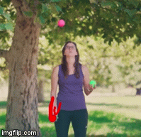

# An openCV Project Medley
An assortment of projects using openCV and python

## Object Tracking in video
See [`ball_tracking.py`](scripts/ball_tracking.py). Following the tutorial from [PyImageSearch](https://www.pyimagesearch.com/2015/09/14/ball-tracking-with-opencv/), I used openCV to track the location of a ball in a juggling video. I displaying the previous positions of the as a trailing red line, which is particularly useful for visualizing the path of your throws when learning how to juggle. This project relies on selecting regions by color and size, and was noticeably more difficult to do with the green ball with the green background.

